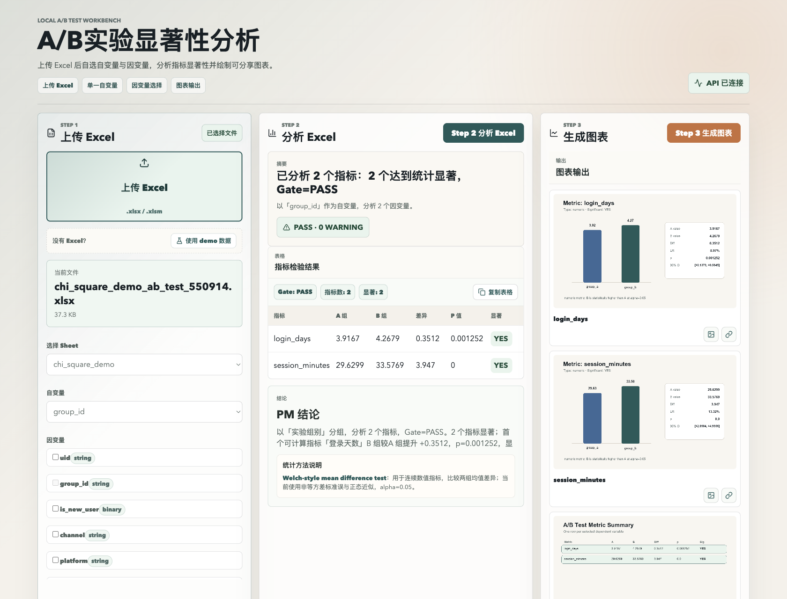
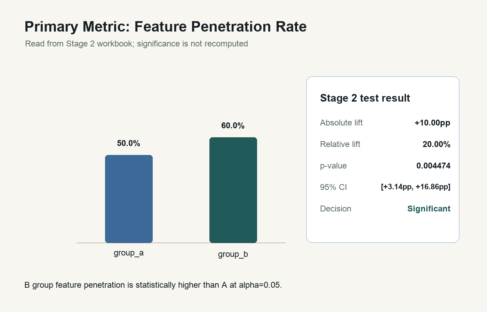
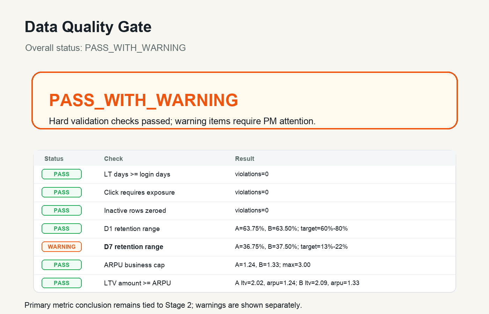

# A/B Test Workbench

面向产品增长实验的本地 A/B 测试分析工作台。项目把原本依赖脚本、Excel 和人工解释的分析流程，整理成一个可复用的 Web 工具：上传实验数据、识别字段、选择指标、执行显著性分析、生成图表，并输出 PM 可读结论。

## 我的角色与产品价值

我在本项目中负责产品目标定义、A/B 测试分析流程拆解、指标结果表达设计、质量 Gate 规则设计和 PM 可读结论设计，并通过 Codex 协作完成本地可运行原型。

项目定位是验证一个面向产品经理的实验分析工作台：用户上传 Excel 数据后，系统不仅返回统计检验结果，还会把显著性、样本质量、指标变化和实验风险转化为产品决策可理解的结论，降低非技术用户解读 A/B 测试结果的门槛。

我重点设计了四个核心环节：

- **数据输入**：支持通过 Excel 上传实验数据，减少对脚本和工程协助的依赖。
- **分析判断**：围绕核心指标完成显著性分析，并解释指标变化是否具有决策意义。
- **质量 Gate**：识别样本量、数据完整性、异常波动等影响实验可信度的问题，避免直接输出误导性结论。
- **结果表达**：将统计结果转化为产品经理可用于复盘、汇报和决策的页面结论与图表。

这个项目体现了我对产品数据分析工具的理解：A/B 测试工具不应只输出统计数字，更应该帮助产品经理判断“实验是否可信、结果是否可用、下一步该如何决策”。

## 项目价值

很多 A/B 测试分析流程停留在“脚本 + Excel + 手动看结果”的阶段：复用成本高，业务同学不容易独立操作，也容易忽略样本量、分组异常和数据质量风险。

本项目将该流程产品化为一个本地工作台，重点解决：

- 让非工程用户可以通过页面完成 Excel 实验数据分析。
- 将 p 值、置信区间、提升幅度、样本量和质量 Gate 聚合到同一结果页。
- 通过 `PASS` / `PASS_WITH_WARNING` / `FAIL` 避免把有风险的数据包装成确定结论。
- 生成可下载 workbook、指标图、汇总图和完整图表合集，便于复盘和分享。

## 核心流程

```text
上传 Excel -> 识别 sheet 和表头 -> 选择分组字段和指标字段 -> 执行显著性分析 -> 生成图表 -> 下载结果
```

## 产品界面预览

通过 demo 数据可以在本地快速跑完整流程：生成样例 Excel、自动识别字段、执行显著性分析，并在同一页面查看 Gate、PM 结论和图表输出。



## 功能亮点

- **Excel 导入**：支持 `.xlsx` / `.xlsm` 上传，自动读取 sheet、识别表头、展示字段类型和样例值。
- **分析配置**：支持 1 个分组字段和 1 到 5 个指标字段。
- **显著性分析**：支持二元指标、连续数值指标和类别指标，输出 p 值、置信区间、差异和相对提升。
- **质量 Gate**：输出 `PASS`、`PASS_WITH_WARNING` 或 `FAIL`，并展示数据质量检查和 WARNING。
- **PM 可读结论**：把统计结果转成适合产品/运营复盘的文字结论。
- **图表生成**：基于分析结果生成指标图、汇总图和完整图表合集，Stage 3 不重新计算显著性。
- **本地优先**：上传文件、分析结果和图表默认写入本地 `storage/`，适合处理不便上传到外部平台的数据。

## 示例图表

仓库中保留了部分生成图表，便于快速理解分析输出形态：





## 技术栈

| 层级 | 技术 |
| --- | --- |
| Frontend | React 19, TypeScript, Vite, lucide-react |
| Backend | FastAPI, Pydantic |
| Data | pandas, openpyxl |
| Chart Rendering | Pillow |
| Storage | Local filesystem under `storage/` |

## 项目结构

```text
.
  backend/                    FastAPI API and analysis services
  frontend/                   React + Vite dashboard
  docs/                       PRD, technical design, test plan
  docs/assets/readme/         README images
  stage3_ab_charts_scripted/  Example generated charts
  *.xlsx                      Sample A/B test workbooks
```

## 本地启动

运行环境建议：

- Node.js 18+
- Python 3.10+

### 1. 启动后端

```bash
cd backend
python3 -m venv .venv
source .venv/bin/activate
pip install -r requirements.txt
uvicorn main:app --reload
```

默认后端地址：

```text
http://127.0.0.1:8000
```

健康检查：

```text
http://127.0.0.1:8000/api/health
```

### 2. 启动前端

```bash
cd frontend
npm install
npm run dev
```

默认前端地址：

```text
http://127.0.0.1:5173
```

## 快速体验

推荐演示方式：

1. 启动后端和前端。
2. 打开 `http://127.0.0.1:5173`，确认右上角显示 `API 已连接`。
3. 点击页面左侧的 `使用 demo 数据`，自动生成示例实验数据。
4. 点击 `Step 2 分析 Excel` 查看 Gate、p 值、置信区间和 PM 结论。
5. 点击 `Step 3 生成图表` 查看指标图、汇总图和完整图表合集。

可以使用仓库中的示例 Excel：

- `ab_test_stage1_feature_penetration.xlsx`
- `ab_test_stage2_analysis.xlsx`
- `ab_test_analysis_sample.xlsx`
- `small_case/ab_test_stage1_small_case.xlsx`
- `small_case_low_lift/ab_test_stage1_low_lift.xlsx`

也可以在页面中点击 demo 入口生成卡方检验示例数据，快速验证类别指标分析和图表生成流程。

完整演示和部署说明见：[Demo and Deployment Guide](docs/demo_deployment.md)。

## API 概览

| Method | Path | Description |
| --- | --- | --- |
| `GET` | `/api/health` | 健康检查 |
| `POST` | `/api/uploads` | 上传 Excel |
| `POST` | `/api/uploads/demo/chi-square` | 生成 demo workbook |
| `POST` | `/api/uploads/{upload_id}/detect-headers` | 识别表头和字段 |
| `POST` | `/api/analysis/jobs` | 执行分析 |
| `GET` | `/api/analysis/jobs/{job_id}/workbook` | 下载分析 workbook |
| `POST` | `/api/analysis/jobs/{job_id}/generate-charts` | 生成图表 |
| `GET` | `/api/charts/{job_id}/{filename}` | 访问图表或 manifest |

## 文档

- [产品 PRD](docs/prd.md)
- [技术说明](docs/technical_design.md)
- [测试计划](docs/test_plan.md)
- [演示与部署方案](docs/demo_deployment.md)
- [项目定位设计](docs/superpowers/specs/2026-06-12-project-positioning-design.md)

## 当前状态

已完成：

- Excel 上传和 demo 数据生成。
- sheet / 表头 / 字段类型识别。
- 分组字段、指标字段和分层字段配置。
- 显著性分析、质量 Gate 和 PM 可读结论。
- Stage 2 workbook 下载。
- Stage 3 图表生成和预览。

待整理：

- 合并或移除历史打包目录 `ab-test-workbench-mvp-no-anova/`。
- 补齐问题上报 API 和页面入口。
- 将前端主文件拆分为更清晰的组件和 API client。
- 增加自动化测试和端到端验收脚本。

## Git 忽略策略

以下内容不会进入仓库：

- Python 虚拟环境：`backend/.venv/`
- 前端依赖和构建产物：`frontend/node_modules/`、`frontend/dist/`
- 本地运行数据：`storage/`
- 缓存和系统文件：`__pycache__/`、`.DS_Store`
- 打包归档：`*.zip`
